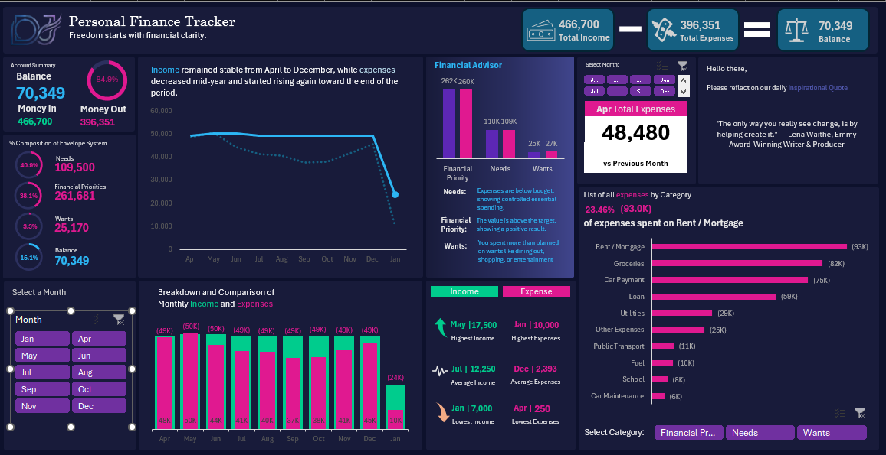

# Personal Finance Tracker Dashboard

[View the Excel Dashboard Preview] (https://bitool6-my.sharepoint.com/:x:/g/personal/davejoshuavirtudazo_bitool6_onmicrosoft_com/IQBsUvuLsRN_QL0EY4UActMaASVELAxjjLOboNZiQNeth2A?e=6R7391)

## Project Overview

This project is an interactive **Personal Finance Dashboard** built in Microsoft Excel.  
It was created as part of my data analytics portfolio to practice dashboard design, PivotTables, slicers, charts, and formula-based insights.

The dashboard tracks income, expenses, budget performance, category breakdowns, and monthly financial trends. It helps users quickly understand where their money goes, how much remains after expenses, and which spending categories need attention.

This dashboard was inspired by an image/template shared by **DSA Philippines**, and I created my own version to apply and improve my Excel dashboarding skills.

---

## Tools Used

- Microsoft Excel
- PivotTables
- Slicers
- Charts
- GETPIVOTDATA
- IFS Formula
- VLOOKUP / Lookup Functions
- Dashboard Design
- Data Analysis

---

## Dashboard Features

- Total income, total expenses, and remaining balance summary
- Monthly slicer for interactive filtering
- Income vs expenses trend analysis
- Budget vs actual comparison
- Expense breakdown by category
- Highest and lowest income/expense highlights
- Dynamic financial notes and insights
- Category-level spending percentage

---

## Key Insights

The dashboard shows that total income reached **466,700**, while total expenses amounted to **396,351**, leaving a positive balance of **70,349**. This means around **15.1%** of income remained after expenses.

The largest expense category was **Rent / Mortgage**, with **93K**, representing about **23.46%** of total expenses. Overall, the dashboard shows a positive cash flow, but spending under **Wants** exceeded the planned budget and may require closer monitoring.

---

## Questions Answered by the Dashboard

### 1. What is the total income?

The total income is **466,700**.

### 2. What is the total expense?

The total expenses are **396,351**.

### 3. How much money is left after expenses?

The remaining balance is **70,349**.

### 4. What percentage of income remains as balance?

The dashboard shows a balance rate of **15.1%**, meaning part of the income was saved or left unspent after expenses.

### 5. Which expense category has the highest spending?

The highest expense category is **Rent / Mortgage**, with **93K**, equal to about **23.46%** of total expenses.

### 6. Are essential expenses within budget?

Yes. The **Needs** category is slightly below budget, showing controlled essential spending.

### 7. Which category exceeded the budget?

The **Wants** category exceeded the budget by around **1.5K**, which suggests that non-essential spending such as dining out, shopping, or entertainment needs closer tracking.

### 8. What is the selected month’s total expense?

For the selected month, **May**, the total expense is **48,480**.

### 9. What does the income and expense trend show?

Income remained mostly stable from April to December, while expenses decreased around the middle of the year and started rising again toward the end of the period.

### 10. What decision can be made from this dashboard?

Focus on reducing discretionary spending under **Wants**, while continuing to monitor major expense categories such as rent, groceries, car payments, and loans.

---

## Skills Demonstrated

- Data cleaning and organization in Excel
- PivotTable reporting
- Dashboard layout and design
- Interactive slicer setup
- KPI creation
- Formula-based analysis
- Financial data storytelling
- Turning raw data into actionable insights

---

## Conclusion

This project demonstrates how Microsoft Excel can be used to build a practical and interactive financial dashboard. It highlights how data can be transformed into clear insights that support better budgeting and financial decision-making.
